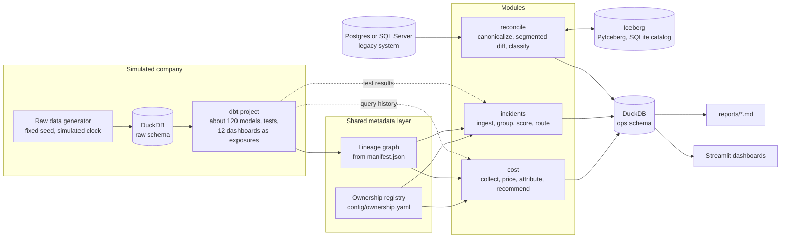

# data-platform-ops

A data platform team is usually judged on three things it only half controls: what the warehouse costs, how fast broken data gets fixed, and whether a migration can be signed off. All three depend on the same missing piece, which is knowing who owns each dataset and what depends on it. Without that, the bill lands on whoever builds the shared tables, alerts page whoever wrote the last model in the chain, and a migration is approved on a spot check and a hope.

This toolkit builds that missing piece once, as a shared metadata layer (an ownership registry and a lineage graph), and puts three modules on top of it:

- **cost** charges every query to exactly one team, under both cloud pricing styles, and finds the waste;
- **incidents** turns a storm of failing data tests into one incident per root cause and pages the person who can fix it;
- **reconcile** proves, row by row and engine by engine, what a migration got wrong, cheaply enough to run every night.

Everything runs on a laptop against a simulated company of five teams and about 120 dbt models, offline, from one command. Every number below comes from that run.

## Architecture



The modules never talk to each other. They share the registry and the lineage graph, and they all write their results as tables in the `ops` schema, which the reports and the dashboards read. Every place a real deployment would talk to an outside system (query history, billing, paging, legacy databases) sits behind a small interface with a local default, so a cloud adapter replaces one piece without touching the logic around it ([ADR 0010](docs/adr/0010-local-first-design.md)).

## Quickstart

You need [uv](https://docs.astral.sh/uv/), Docker, GNU make and a machine with 16 GB of memory.

```bash
cp .env.example .env      # local passwords for the legacy databases
make setup                # Python dependencies
make up                   # Postgres, the default legacy system
make demo                 # all four steps from a clean state, a few minutes
make dashboard            # http://localhost:8501
make readme-check         # every results number in the READMEs, against reports/
```

`make demo` writes `reports/cost.md`, `reports/incidents.md` with a postmortem draft per SEV1 in `reports/postmortems/`, and `reports/reconciliation.md`. Two runs write byte-identical reports. `make test` and `make lint` run without Docker, as CI does.

SQL Server is optional: `docker compose --profile sqlserver up -d`, `uv sync --extra sqlserver`, then `uv run --extra sqlserver platform-ops reconcile run --engine sqlserver`.

## Results

From `make demo` at the default scale, over a 91-day simulated window for cost, three simulated weeks for incidents, and a year of legacy data for the migration.

The run took 6 minutes 54 seconds and 9 minutes 1 second on the same laptop in two clean runs. <!-- readme-check: runtime -->

**Cost: the bill is idle warehouses, not dead tables.** Thirteen weeks of dbt runs, dashboard refreshes and ad hoc SQL cost $296.02 under warehouse (compute) pricing and $3.35 under on-demand scan pricing. Dashboards alone are $167.90 against $0.6514, because every refresh wakes the BI warehouse for seconds of work and minutes of idling: 99% of its billed time is idle. The 12 abandoned models the project plants are found exactly, and together cost almost nothing. For a platform lead, that changes the conversation with the business teams from "delete your old tables" to "refresh your dashboards less often, or move them to a shared warehouse", and showback makes each team see its own share: platform, which builds every shared layer, is the cheapest team under compute pricing at $26.56 and the most expensive under scan pricing at $0.8314.

**Incidents: routing matters more than grouping.** Eight planted faults failed 18 checks, which became 8 incidents and 8 pages, 56% fewer pages than one per failing check. The bigger win is who gets them. Paging whoever owns the failing node sends 13 of the 18 alerts to marco, who owns the staging models, and gets the person right 3 of 8 times. Paging the owner of the source when a staging model fails gets it right 8 of 8 times and moves the load to priya, who owns the feeds, from 1 alert to 6 pages. Every fault was detected at the first nightly run it could be (16.0 hours after it landed), except the stale source, which freshness only flags after two days.

**Migration: not signed off, and the diff says why.** The delivered migration job fails the sign-off thresholds on every table. The segmented checksum diff found all 199,465 planted discrepancies and named the right cause for each: a daylight saving bug that shifts 195,478 payments by an hour, a float cast that rounds 1,434 large orders, trimmed padding on 2,497 company names, and 12 orders lost at batch boundaries. With those defects fixed, only 44 one-off discrepancies remain, and the diff saves between 90.443% and 99.358% of the rows a full comparison would move, which is what makes nightly verification of a large migration affordable rather than a one-off before cutover.

Detail, and what each number means, is in the module READMEs: [cost](src/platform_ops/cost/README.md), [incidents](src/platform_ops/incidents/README.md), [reconcile](src/platform_ops/reconcile/README.md), [metadata](src/platform_ops/metadata/README.md), [simulation](src/platform_ops/simulation/README.md) and [dashboards](dashboards/README.md).

## How the decisions were made

Each choice that shapes a number is recorded, with what it costs:

| ADR | Decision |
|---|---|
| [0001](docs/adr/0001-postgres-as-default-legacy-source.md) | Postgres as the default legacy source, SQL Server behind a profile |
| [0002](docs/adr/0002-ownership-resolution-and-platform-team.md) | Most specific ownership rule wins; the platform team owns the shared layers |
| [0003](docs/adr/0003-source-freshness-on-simulated-time.md) | Source freshness on simulated time |
| [0004](docs/adr/0004-deterministic-data-generation.md) | Deterministic data generation |
| [0005](docs/adr/0005-scan-estimate-and-modelled-compute-time.md) | Bytes from logical sizes, compute time from a model |
| [0006](docs/adr/0006-pricing-models-and-attribution.md) | Pluggable pricing, each query charged exactly once |
| [0007](docs/adr/0007-simulated-workload-real-builds-daily-replay.md) | Real dbt builds every four weeks, daily runs replayed |
| [0008](docs/adr/0008-incident-grouping-severity-and-routing.md) | Incident grouping, severity and routing |
| [0009](docs/adr/0009-cross-engine-hashing-and-canonicalization.md) | Cross-engine hashing and canonicalization |
| [0010](docs/adr/0010-local-first-design.md) | Local first, every external system behind an interface |

## Repository layout

```
config/            settings, teams and the ownership registry
dbt/               the simulated company's dbt project
src/platform_ops/  common, metadata, simulation, cost, incidents, reconcile, dashboard
dashboards/        the Streamlit app
scripts/           vendor fixture generator, README check
tests/             unit, integration and contract tests
docs/              SPEC, PROGRESS and the ADRs
```

The build plan is in [docs/SPEC.md](docs/SPEC.md), and [docs/PROGRESS.md](docs/PROGRESS.md) records what was decided along the way and why.
